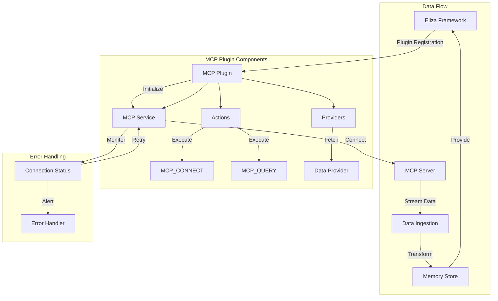

# Building MCP Server Plugins

## Overview

MCP (Model Context Protocol) servers are specialized TypeScript/JavaScript tools that integrate directly into the Eliza framework, enhancing its data ingestion and plugin capabilities. Each MCP server implements a standardized protocol for bi-directional communication with Eliza, allowing for real-time data streaming and tool execution.

## Key Concepts

1. **MCP Service Integration**
   - MCP servers run as dedicated services within Eliza
   - They provide real-time data streaming capabilities
   - Support bi-directional communication with the Eliza core

2. **TypeScript Framework Benefits**
   - Type-safe tool definitions and responses
   - Built-in validation through Zod schemas
   - Automatic API documentation generation
   - Hot-reloading during development

3. **Plugin Architecture**
   - Modular design for easy extension
   - Standardized communication protocols
   - Built-in error handling and recovery
   - Automatic reconnection management

## Architecture Flow



## Implementation Guide

### Directory Structure

```
mcp-plugin/
├── src/
│   ├── services/
│   │   ├── MCPService.ts       # Core MCP service implementation
│   │   └── ConnectionManager.ts # Connection management
│   ├── providers/
│   │   └── MCPDataProvider.ts  # Data provider implementation
│   ├── tools/
│   │   ├── base/
│   │   │   └── BaseMCPTool.ts  # Base tool implementation
│   │   └── implementations/    # Specific tool implementations
│   ├── types/
│   │   └── index.ts           # TypeScript type definitions
│   └── plugin.ts              # Plugin entry point
├── tests/
│   └── integration/           # Integration tests
└── package.json
```

### Core Components

1. **MCP Service**
```typescript
// src/services/MCPService.ts
import { ElizaPlugin, PluginContext } from '@eliza/core';
import { MCPConnection } from '@modelcontextprotocol/sdk';

export class MCPService implements ElizaPlugin {
    private connection: MCPConnection;

    constructor(private context: PluginContext) {
        this.connection = new MCPConnection({
            reconnect: true,
            maxRetries: 3,
            timeout: 5000
        });
    }

    async onInit() {
        await this.connection.connect();
        this.registerTools();
        this.setupEventHandlers();
    }

    private registerTools() {
        // Register MCP tools with Eliza
        this.context.registerTool('mcp_query', this.handleQuery.bind(this));
        this.context.registerTool('mcp_stream', this.handleStream.bind(this));
    }

    private async setupEventHandlers() {
        // Handle Eliza lifecycle events
        this.context.on('plugin:beforeInit', this.handleBeforeInit.bind(this));
        this.context.on('plugin:afterInit', this.handleAfterInit.bind(this));
        this.context.on('plugin:beforeDestroy', this.handleBeforeDestroy.bind(this));

        // Handle MCP-specific events
        this.connection.on('data', this.handleData.bind(this));
        this.connection.on('error', this.handleError.bind(this));
        this.connection.on('reconnect', this.handleReconnect.bind(this));
    }

    private async handleData(data: MCPData) {
        // Process incoming data
        await this.context.memory.store.write({
            type: 'mcp_data',
            content: data,
            metadata: {
                timestamp: new Date().toISOString(),
                source: this.connection.id
            }
        });
    }

    private async handleError(error: Error) {
        this.context.logger.error('MCP connection error', {
            error,
            connectionId: this.connection.id
        });

        // Notify Eliza about the error
        await this.context.notify({
            type: 'error',
            source: 'mcp_service',
            message: error.message
        });
    }
}
```

2. **Data Provider**
```typescript
// src/providers/MCPDataProvider.ts
import { DataProvider, DataQuery } from '@eliza/core';
import { MCPQueryResult } from '@modelcontextprotocol/sdk';

export class MCPDataProvider implements DataProvider {
    constructor(private context: PluginContext) {}

    async query(query: DataQuery): Promise<MCPQueryResult> {
        // Check memory store first
        const cached = await this.context.memory.store.read({
            type: 'mcp_data',
            query: query.filter
        });

        if (cached) {
            return cached;
        }

        // Fetch fresh data if not in memory
        const result = await this.fetchData(query);

        // Store in memory for future use
        await this.context.memory.store.write({
            type: 'mcp_data',
            content: result,
            metadata: {
                timestamp: new Date().toISOString(),
                query: query.filter
            }
        });

        return result;
    }

    async stream(query: DataQuery): AsyncIterator<MCPQueryResult> {
        // Implement streaming logic
        return this.createDataStream(query);
    }
}
```

### Tool Implementation

```typescript
// src/tools/base/BaseMCPTool.ts
import { Tool, ToolContext } from '@eliza/core';
import { z } from 'zod';

export abstract class BaseMCPTool implements Tool {
    abstract name: string;
    abstract schema: z.ZodSchema;

    async execute(context: ToolContext, input: unknown) {
        const validated = this.schema.parse(input);
        return this.process(context, validated);
    }

    protected abstract process(context: ToolContext, input: any): Promise<any>;
}
```

### Example Tool Implementation

```typescript
// src/tools/implementations/DataQueryTool.ts
import { BaseMCPTool } from '../base/BaseMCPTool';
import { z } from 'zod';

const QuerySchema = z.object({
    query: z.string(),
    filters: z.object({
        startDate: z.string().datetime(),
        endDate: z.string().datetime(),
        limit: z.number().min(1).max(100)
    }).optional()
});

export class DataQueryTool extends BaseMCPTool {
    name = 'data_query';
    schema = QuerySchema;

    protected async process(context: ToolContext, input: z.infer<typeof QuerySchema>) {
        const { query, filters } = input;

        try {
            const result = await this.executeQuery(query, filters);
            return this.formatResponse(result);
        } catch (error) {
            context.logger.error('Query execution failed', { error, query });
            throw new MCPError('Query failed', 'QUERY_ERROR', error);
        }
    }

    private async executeQuery(query: string, filters?: any) {
        // Implementation
    }

    private formatResponse(data: any) {
        return {
            type: 'query_result',
            data,
            metadata: {
                timestamp: new Date().toISOString(),
                source: this.name
            }
        };
    }
}
```

### Testing Implementation

```typescript
// src/tests/integration/DataQueryTool.test.ts
import { DataQueryTool } from '../../tools/implementations/DataQueryTool';
import { ToolContext } from '@eliza/core';
import { MCPError } from '../../utils/errors';

describe('DataQueryTool Integration Tests', () => {
    let tool: DataQueryTool;
    let context: ToolContext;

    beforeEach(() => {
        tool = new DataQueryTool();
        context = {
            logger: {
                debug: jest.fn(),
                info: jest.fn(),
                warn: jest.fn(),
                error: jest.fn()
            },
            memory: {
                store: {
                    read: jest.fn(),
                    write: jest.fn()
                }
            }
        } as unknown as ToolContext;
    });

    test('should execute query successfully', async () => {
        const input = {
            query: 'test query',
            filters: {
                startDate: '2024-01-01T00:00:00Z',
                endDate: '2024-12-31T23:59:59Z',
                limit: 50
            }
        };

        const result = await tool.execute(context, input);

        expect(result).toMatchObject({
            type: 'query_result',
            data: expect.any(Object),
            metadata: {
                timestamp: expect.any(String),
                source: 'data_query'
            }
        });
    });

    test('should handle validation errors', async () => {
        const invalidInput = {
            query: 'test query',
            filters: {
                startDate: 'invalid-date',
                limit: 200 // exceeds max limit
            }
        };

        await expect(tool.execute(context, invalidInput))
            .rejects
            .toThrow(MCPError);
    });

    test('should use memory cache when available', async () => {
        const input = {
            query: 'cached query'
        };

        const cachedResult = {
            type: 'query_result',
            data: { cached: true },
            metadata: {
                timestamp: new Date().toISOString()
            }
        };

        (context.memory.store.read as jest.Mock).mockResolvedValueOnce(cachedResult);

        const result = await tool.execute(context, input);

        expect(result).toEqual(cachedResult);
        expect(context.memory.store.read).toHaveBeenCalledWith({
            type: 'mcp_data',
            query: input
        });
    });
});
```

### Additional Tool Examples

1. **WebhookTool Implementation**
```typescript
// src/tools/implementations/WebhookTool.ts
import { BaseMCPTool } from '../base/BaseMCPTool';
import { z } from 'zod';

const WebhookSchema = z.object({
    url: z.string().url(),
    method: z.enum(['GET', 'POST', 'PUT', 'DELETE']),
    headers: z.record(z.string()).optional(),
    body: z.unknown().optional(),
    timeout: z.number().min(1000).max(30000).default(5000)
});

export class WebhookTool extends BaseMCPTool {
    name = 'webhook';
    schema = WebhookSchema;

    protected async process(context: ToolContext, input: z.infer<typeof WebhookSchema>) {
        const { url, method, headers, body, timeout } = input;

        try {
            const controller = new AbortController();
            const timeoutId = setTimeout(() => controller.abort(), timeout);

            const response = await fetch(url, {
                method,
                headers: {
                    'Content-Type': 'application/json',
                    ...headers
                },
                body: body ? JSON.stringify(body) : undefined,
                signal: controller.signal
            });

            clearTimeout(timeoutId);

            if (!response.ok) {
                throw new MCPError(
                    `HTTP ${response.status}: ${response.statusText}`,
                    'HTTP_ERROR',
                    { status: response.status }
                );
            }

            const data = await response.json();
            return this.formatResponse(data);
        } catch (error) {
            context.logger.error('Webhook execution failed', { error, url });
            throw new MCPError('Webhook failed', 'WEBHOOK_ERROR', error);
        }
    }

    private formatResponse(data: any) {
        return {
            type: 'webhook_response',
            data,
            metadata: {
                timestamp: new Date().toISOString(),
                source: this.name
            }
        };
    }
}
```

2. **StreamingTool Implementation**
```typescript
// src/tools/implementations/StreamingTool.ts
import { BaseMCPTool } from '../base/BaseMCPTool';
import { z } from 'zod';

const StreamSchema = z.object({
    channel: z.string(),
    filter: z.object({
        type: z.string(),
        pattern: z.string()
    }).optional()
});

export class StreamingTool extends BaseMCPTool {
    name = 'stream_data';
    schema = StreamSchema;

    protected async process(context: ToolContext, input: z.infer<typeof StreamSchema>) {
        const { channel, filter } = input;

        return new Promise((resolve, reject) => {
            const stream = this.createStream(channel, filter);
            const chunks: any[] = [];

            stream.on('data', (chunk) => {
                chunks.push(chunk);

                // Notify about new data
                context.notify({
                    type: 'stream_update',
                    source: this.name,
                    data: chunk
                });
            });

            stream.on('end', () => {
                resolve({
                    type: 'stream_complete',
                    data: chunks,
                    metadata: {
                        timestamp: new Date().toISOString(),
                        source: this.name,
                        channel
                    }
                });
            });

            stream.on('error', (error) => {
                reject(new MCPError('Stream failed', 'STREAM_ERROR', error));
            });
        });
    }

    private createStream(channel: string, filter?: any) {
        // Implementation of streaming logic
    }
}
```

### Utility Functions

```typescript
// src/utils/validation.ts
import { z } from 'zod';
import { MCPError } from './errors';

export function validateConfig<T extends z.ZodSchema>(
    schema: T,
    config: unknown
): z.infer<T> {
    try {
        return schema.parse(config);
    } catch (error) {
        if (error instanceof z.ZodError) {
            throw new MCPError(
                'Configuration validation failed',
                'CONFIG_ERROR',
                error.errors
            );
        }
        throw error;
    }
}

// src/utils/retry.ts
export async function withRetry<T>(
    fn: () => Promise<T>,
    options: {
        maxRetries: number;
        delay: number;
        backoff?: number;
    }
): Promise<T> {
    let lastError: Error;
    let attempt = 0;

    while (attempt < options.maxRetries) {
        try {
            return await fn();
        } catch (error) {
            lastError = error as Error;
            attempt++;

            if (attempt < options.maxRetries) {
                const delay = options.delay * Math.pow(options.backoff || 2, attempt - 1);
                await new Promise(resolve => setTimeout(resolve, delay));
            }
        }
    }

    throw new MCPError(
        'Operation failed after retries',
        'RETRY_ERROR',
        { attempts: attempt, lastError }
    );
}
```

## Best Practices

1. **Tool Design**
   - Implement one tool per file for better organization
   - Use TypeScript interfaces for type safety
   - Leverage Zod schemas for runtime validation
   - Handle errors gracefully with proper typing

2. **Data Flow**
   - Use async iterators for streaming data
   - Implement backpressure handling
   - Cache results when appropriate
   - Transform data to match Eliza's expected format

3. **Error Handling**
   - Implement proper error recovery
   - Use typed error classes
   - Log errors with context
   - Provide meaningful error messages

4. **Performance**
   - Implement connection pooling
   - Use proper memory management
   - Handle concurrent requests efficiently
   - Implement proper timeout handling

## References

- [Eliza Plugin Development Guide](docs/plugin-development.md)
- [MCP Protocol Specification](https://mcp-protocol.org/spec)
- [MCP TypeScript SDK Documentation](https://github.com/mcp/typescript-sdk)
- [Example Implementations](packages/examples)