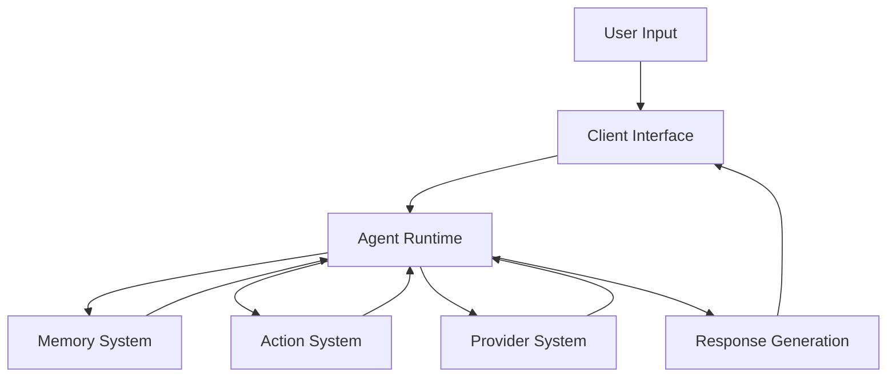
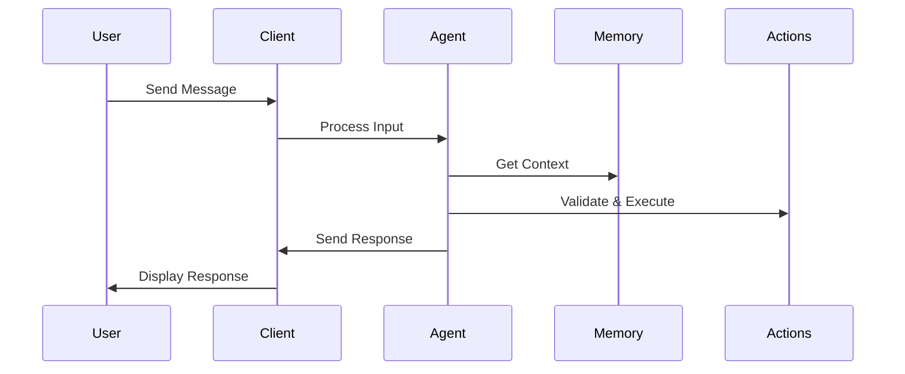
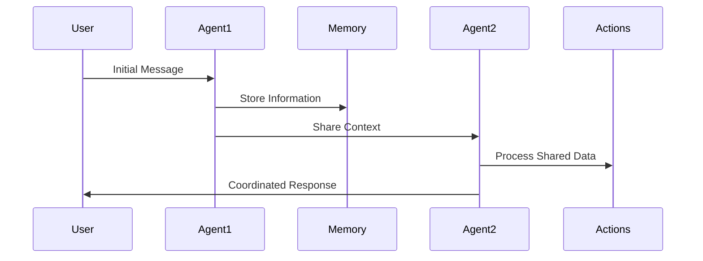
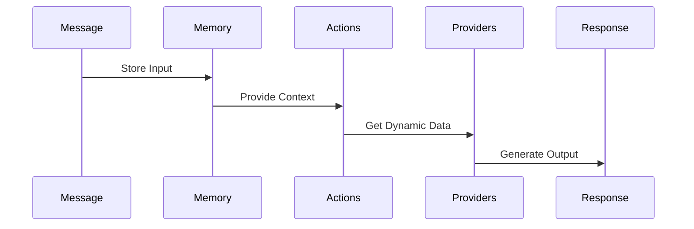

# Eliza Data Flow Guide

## System Overview

Eliza is a multi-agent system where each agent operates as an autonomous entity, processing messages and interacting through various channels. Here's how data flows through the system:



## Data Flow Steps

1. **Input Reception**
   ```typescript
   // Message enters through a client (Discord, Telegram, etc.)
   interface Message {
     userId: string;
     content: { text: string };
     roomId: string;
     timestamp: number;
   }
   ```

2. **State Composition**
   ```typescript
   // Agent runtime composes current state
   const state = await runtime.composeState(message, {
     additionalContext: await providers.getContext()
   });
   ```

3. **Memory Integration**
   ```typescript
   // Recent messages and facts are retrieved
   const memories = await messageManager.getMemories({
     roomId: message.roomId,
     count: 10
   });
   ```

4. **Action Selection**
   ```typescript
   // Actions are validated and selected
   const validActions = await Promise.all(
     actions.map(action => action.validate(runtime, message))
   );
   ```

5. **Response Generation**
   ```typescript
   // Final response is generated and sent back
   const response = await generateResponse(runtime, message, state);
   await client.send(response);
   ```

## Key Components and Their Roles

### 1. Client Interface
- Handles user input/output
- Manages platform-specific formatting
- Routes messages to appropriate agents

### 2. Agent Runtime
- Core processing unit
- Manages state and context
- Coordinates between components

### 3. Memory System
```typescript
// Three types of memory
interface MemorySystem {
  messageManager: IMemoryManager;    // Recent conversations
  descriptionManager: IMemoryManager; // User/context facts
  loreManager: IMemoryManager;       // Static knowledge
}
```

### 4. Action System
```typescript
// Defines agent behaviors
interface Action {
  name: string;
  validate: (runtime: IAgentRuntime, message: Memory) => Promise<boolean>;
  handler: (runtime: IAgentRuntime, message: Memory) => Promise<void>;
}
```

### 5. Provider System
```typescript
// Injects dynamic context
interface Provider {
  get: (runtime: IAgentRuntime, message: Memory) => Promise<string>;
}
```

## Common Workflows

### 1. Basic Message Processing


### 2. Multi-Agent Interaction


### 3. Memory-Action Flow


## Quick Implementation Guide

### 1. Setting Up an Agent
```typescript
const runtime = new AgentRuntime({
  character: characterConfig,
  actions: customActions,
  providers: customProviders,
  memory: memorySystem
});
```

### 2. Processing Messages
```typescript
async function handleMessage(message: Message) {
  // 1. Compose State
  const state = await runtime.composeState(message);

  // 2. Get Memory Context
  const context = await runtime.getMemoryContext(message);

  // 3. Select Action
  const action = await runtime.selectAction(message, state);

  // 4. Generate Response
  return await runtime.generateResponse(message, state, action);
}
```

### 3. Implementing Custom Actions
```typescript
const customAction: Action = {
  name: "CUSTOM_ACTION",
  validate: async (runtime, message) => {
    // Validation logic
    return true;
  },
  handler: async (runtime, message) => {
    // Implementation
    const response = await processCustomLogic(message);
    await runtime.sendResponse(response);
  }
};
```

## Best Practices for Data Flow

1. **Memory Management**
   - Keep recent context in message memory
   - Store important facts in description memory
   - Use lore for static knowledge

2. **Action Processing**
   - Validate before executing
   - Handle errors gracefully
   - Maintain action atomicity

3. **Provider Integration**
   - Cache frequently used data
   - Handle provider failures
   - Update dynamic data regularly

4. **State Management**
   - Keep state immutable
   - Update through proper channels
   - Maintain consistency

## Common Use Cases

### 1. Customer Service Bot
```typescript
const serviceBot = new AgentRuntime({
  character: {
    name: "ServiceBot",
    bio: "Customer service specialist",
    actions: [
      "HANDLE_INQUIRY",
      "ESCALATE_ISSUE",
      "PROVIDE_SOLUTION"
    ]
  }
});
```

### 2. Trading Assistant
```typescript
const tradingBot = new AgentRuntime({
  character: {
    name: "TradingBot",
    bio: "Financial analysis expert",
    actions: [
      "ANALYZE_MARKET",
      "PLACE_ORDER",
      "MONITOR_PORTFOLIO"
    ]
  }
});
```

### 3. Knowledge Base Bot
```typescript
const kbBot = new AgentRuntime({
  character: {
    name: "KnowledgeBot",
    bio: "Information retrieval specialist",
    actions: [
      "SEARCH_DOCS",
      "SUMMARIZE_CONTENT",
      "ANSWER_QUERY"
    ]
  }
});
```

This guide provides a clear understanding of how data flows through the Eliza system, making it easier to build and extend applications on the platform. Use the diagrams and examples as reference points when implementing your own agents and features.