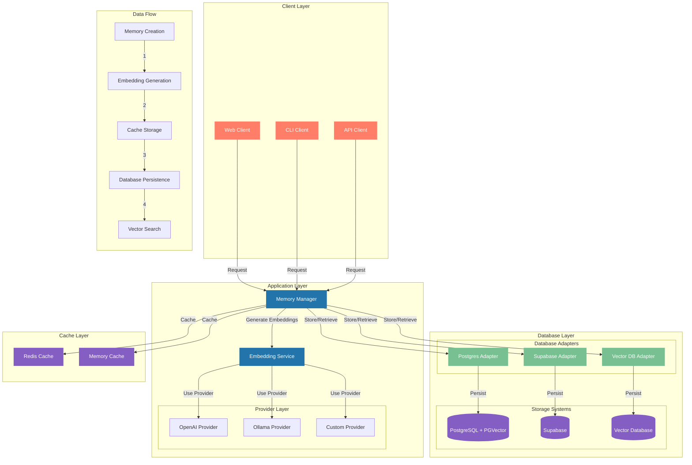
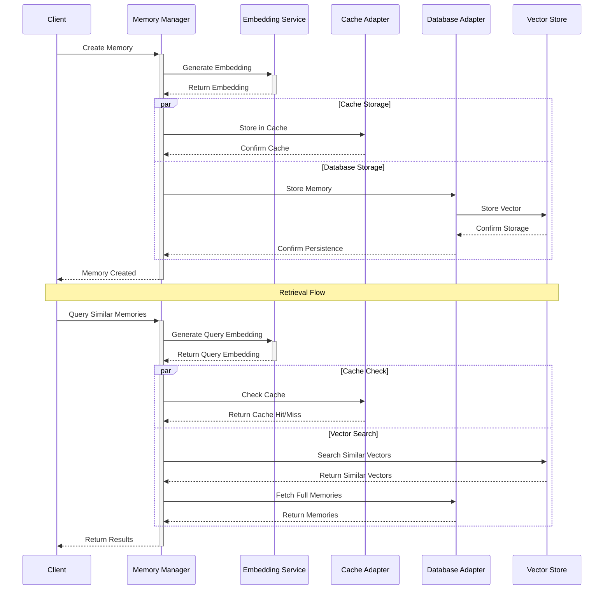
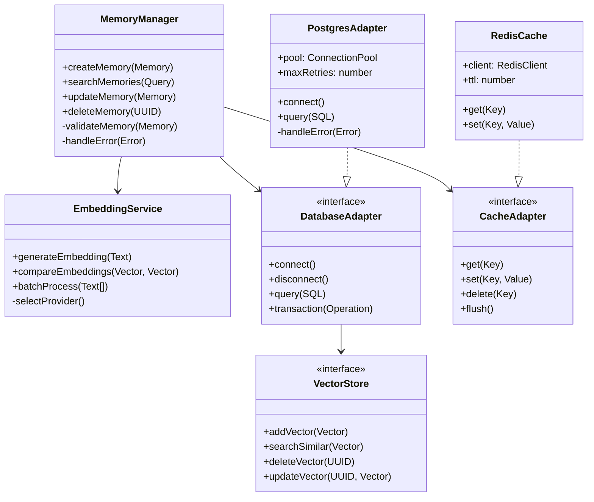

# Memory, Embeddings, and Database Systems in Eliza

## Table of Contents

1. [Memory Architecture](#memory-architecture)
2. [Database Adapters](#database-adapters)
3. [Vector Embeddings](#vector-embeddings)
4. [Implementation Guide](#implementation-guide)
5. [Docker Setup](#docker-setup)
6. [Alternative Vector Databases](#alternative-vector-databases)
7. [Technical Component Details](#technical-component-details)

## Memory Architecture

### System Architecture Diagram



### Memory Flow Diagram



### Component Interaction Diagram



## Database Adapters

### Core Interface

```typescript
interface IDatabaseAdapter {
    // Memory Operations
    createMemory(memory: Memory): Promise<Memory>;
    getMemory(id: string): Promise<Memory>;
    updateMemory(id: string, updates: Partial<Memory>): Promise<Memory>;
    deleteMemory(id: string): Promise<void>;
    
    // Vector Operations
    addEmbedding(memoryId: string, embedding: number[]): Promise<void>;
    searchSimilar(embedding: number[], limit: number): Promise<Memory[]>;
    
    // Maintenance
    cleanup(): Promise<void>;
    healthCheck(): Promise<boolean>;
}
```

### Postgres Implementation with pgvector

```typescript
import { DatabaseAdapter } from '@ai16z/eliza';
import { Pool } from 'pg';
import { Vector } from 'pgvector';

export class PostgresDatabaseAdapter extends DatabaseAdapter {
    private pool: Pool;
    
    constructor(config: PostgresConfig) {
        super();
        this.pool = new Pool(config);
    }
    
    async addEmbedding(memoryId: string, embedding: number[]): Promise<void> {
        const query = `
            UPDATE memories 
            SET embedding = $1 
            WHERE id = $2
        `;
        await this.pool.query(query, [embedding, memoryId]);
    }
    
    async searchSimilar(embedding: number[], limit: number): Promise<Memory[]> {
        const query = `
            SELECT *, embedding <-> $1 as distance
            FROM memories
            WHERE embedding IS NOT NULL
            ORDER BY distance
            LIMIT $2
        `;
        const result = await this.pool.query(query, [embedding, limit]);
        return result.rows;
    }
}
```

## Vector Embeddings

### Embedding Service

```typescript
interface EmbeddingService {
    generateEmbedding(text: string): Promise<number[]>;
    compareEmbeddings(a: number[], b: number[]): number;
    batchProcess(texts: string[]): Promise<number[][]>;
}
```

### Implementation with Multiple Providers

```typescript
class MultiProviderEmbeddingService implements EmbeddingService {
    private providers: Map<string, EmbeddingProvider>;
    
    constructor(config: EmbeddingConfig) {
        this.providers = new Map();
        if (config.openai) {
            this.providers.set('openai', new OpenAIEmbedding(config.openai));
        }
        if (config.ollama) {
            this.providers.set('ollama', new OllamaEmbedding(config.ollama));
        }
    }
    
    async generateEmbedding(text: string): Promise<number[]> {
        const provider = this.getDefaultProvider();
        return provider.embed(text);
    }
}
```

## Implementation Guide

### Setting Up Postgres with pgvector

1. Create the Database Schema:

```sql
CREATE EXTENSION IF NOT EXISTS vector;

CREATE TABLE memories (
    id UUID PRIMARY KEY,
    type TEXT NOT NULL,
    content JSONB NOT NULL,
    embedding vector(1536),
    created_at TIMESTAMPTZ DEFAULT CURRENT_TIMESTAMP
);

CREATE INDEX ON memories USING ivfflat (embedding vector_cosine_ops)
    WITH (lists = 100);
```

2. Configure the Adapter:

```typescript
const adapter = new PostgresDatabaseAdapter({
    host: 'localhost',
    port: 5432,
    database: 'eliza',
    user: 'postgres',
    password: 'your_password'
});
```

### Error Handling and Retries

```typescript
class ResilientDatabaseAdapter extends PostgresDatabaseAdapter {
    private maxRetries = 3;
    
    async withRetry<T>(operation: () => Promise<T>): Promise<T> {
        for (let attempt = 1; attempt <= this.maxRetries; attempt++) {
            try {
                return await operation();
            } catch (error) {
                if (attempt === this.maxRetries) throw error;
                await this.delay(attempt * 1000);
            }
        }
        throw new Error('Operation failed after retries');
    }
}
```

## Docker Setup

### Docker Compose Configuration

```yaml
version: '3.8'
services:
  postgres:
    image: ankane/pgvector:latest
    environment:
      POSTGRES_DB: eliza
      POSTGRES_USER: postgres
      POSTGRES_PASSWORD: your_password
    volumes:
      - postgres_data:/var/lib/postgresql/data
      - ./init.sql:/docker-entrypoint-initdb.d/init.sql
    ports:
      - "5432:5432"

volumes:
  postgres_data:
```

### Initialization Script (init.sql)

```sql
CREATE EXTENSION IF NOT EXISTS vector;

-- Create tables and indexes
\i /docker-entrypoint-initdb.d/schema.sql
```

## Alternative Vector Databases

### Weaviate Integration

```typescript
import { Client } from 'weaviate-ts-client';

class WeaviateAdapter extends DatabaseAdapter {
    private client: Client;
    
    constructor(config: WeaviateConfig) {
        super();
        this.client = new Client({
            scheme: config.scheme,
            host: config.host
        });
    }
    
    async searchSimilar(embedding: number[], limit: number): Promise<Memory[]> {
        const result = await this.client.graphql
            .get()
            .withClassName('Memory')
            .withNearVector({
                vector: embedding,
                certainty: 0.7
            })
            .withLimit(limit)
            .do();
            
        return result.data.Get.Memory;
    }
}
```

### QDrant Integration

```typescript
import { QdrantClient } from '@qdrant/js-client-rest';

class QdrantAdapter extends DatabaseAdapter {
    private client: QdrantClient;
    
    constructor(config: QdrantConfig) {
        super();
        this.client = new QdrantClient({
            url: config.url,
            apiKey: config.apiKey
        });
    }
    
    async searchSimilar(embedding: number[], limit: number): Promise<Memory[]> {
        const result = await this.client.search('memories', {
            vector: embedding,
            limit: limit,
            with_payload: true
        });
        
        return result.map(this.convertToMemory);
    }
}
```

## Prompts for Implementation

### Memory System Prompt

```text
You are implementing the memory system for Eliza. Consider:

1. Memory Types:
   - Short-term conversation history
   - Long-term knowledge storage
   - Working memory for computations

2. Key Requirements:
   - Fast retrieval of recent context
   - Efficient similarity search
   - Proper handling of memory expiration
   - Thread-safe operations

3. Implementation Focus:
   - Use appropriate data structures
   - Implement proper error handling
   - Ensure data consistency
   - Optimize for performance
```

### Database Adapter Prompt

```text
You are implementing a database adapter for Eliza. Consider:

1. Core Functionality:
   - CRUD operations for memories
   - Vector similarity search
   - Efficient batch operations
   - Connection pooling

2. Error Handling:
   - Connection failures
   - Query timeouts
   - Data validation
   - Retry mechanisms

3. Performance:
   - Connection pooling
   - Query optimization
   - Proper indexing
   - Batch operations
```

### Vector Search Prompt

```text
You are implementing vector search functionality. Consider:

1. Search Requirements:
   - Cosine similarity
   - Approximate nearest neighbors
   - Filtering capabilities
   - Performance optimization

2. Implementation Details:
   - Index structure
   - Search algorithm
   - Distance metrics
   - Result ranking

3. Optimization:
   - Index maintenance
   - Query performance
   - Memory usage
   - Batch processing
```

## Technical Component Details

### 1. Memory Manager Implementation

```typescript
class MemoryManager {
    private cache: CacheAdapter;
    private db: DatabaseAdapter;
    private embedding: EmbeddingService;
    private config: MemoryConfig;

    constructor(config: MemoryConfig) {
        this.config = {
            cacheTTL: 3600,          // Cache lifetime in seconds
            batchSize: 100,          // Batch processing size
            retryAttempts: 3,        // Number of retry attempts
            vectorDimension: 1536,   // Vector dimension (OpenAI default)
            similarityThreshold: 0.8, // Minimum similarity score
            ...config
        };
    }

    async createMemory(input: CreateMemoryInput): Promise<Memory> {
        try {
            // 1. Validate input
            this.validateInput(input);

            // 2. Generate embedding
            const embedding = await this.embedding.generateEmbedding(input.content);

            // 3. Create memory object
            const memory: Memory = {
                id: crypto.randomUUID(),
                type: input.type,
                content: input.content,
                metadata: {
                    timestamp: Date.now(),
                    source: input.source,
                    userId: input.userId,
                    tags: input.tags || [],
                },
                embedding
            };

            // 4. Store in cache and database
            await Promise.all([
                this.cache.set(memory.id, memory),
                this.db.createMemory(memory)
            ]);

            return memory;
        } catch (error) {
            this.handleError('createMemory', error);
            throw error;
        }
    }

    async searchSimilar(query: string, options: SearchOptions): Promise<Memory[]> {
        // 1. Generate query embedding
        const queryEmbedding = await this.embedding.generateEmbedding(query);

        // 2. Search vector store
        const results = await this.db.searchSimilar(queryEmbedding, {
            limit: options.limit || 10,
            threshold: options.threshold || this.config.similarityThreshold,
            filters: options.filters
        });

        // 3. Cache results
        await this.cacheResults(results);

        return results;
    }

    private async cacheResults(memories: Memory[]): Promise<void> {
        const cacheOperations = memories.map(memory => 
            this.cache.set(memory.id, memory, this.config.cacheTTL)
        );
        await Promise.all(cacheOperations);
    }
}
```

### 2. Database Adapter Details

#### PostgreSQL Schema with pgvector

```sql
-- Enable required extensions
CREATE EXTENSION IF NOT EXISTS vector;
CREATE EXTENSION IF NOT EXISTS pgcrypto;
CREATE EXTENSION IF NOT EXISTS pg_trgm;

-- Memories table with vector support
CREATE TABLE memories (
    id UUID PRIMARY KEY DEFAULT gen_random_uuid(),
    type VARCHAR(50) NOT NULL,
    content JSONB NOT NULL,
    metadata JSONB NOT NULL,
    embedding vector(1536),
    created_at TIMESTAMPTZ DEFAULT CURRENT_TIMESTAMP,
    updated_at TIMESTAMPTZ DEFAULT CURRENT_TIMESTAMP,
    
    -- Indexes
    CONSTRAINT valid_type CHECK (type IN ('conversation', 'knowledge', 'temporary')),
    CONSTRAINT valid_metadata CHECK (jsonb_typeof(metadata) = 'object')
);

-- Create indexes
CREATE INDEX idx_memories_type ON memories(type);
CREATE INDEX idx_memories_created_at ON memories(created_at);
CREATE INDEX idx_memories_metadata ON memories USING gin(metadata);
CREATE INDEX idx_memories_embedding ON memories USING ivfflat (embedding vector_cosine_ops)
    WITH (lists = 100);

-- Update trigger for updated_at
CREATE OR REPLACE FUNCTION update_updated_at()
RETURNS TRIGGER AS $$
BEGIN
    NEW.updated_at = CURRENT_TIMESTAMP;
    RETURN NEW;
END;
$$ LANGUAGE plpgsql;

CREATE TRIGGER memories_updated_at
    BEFORE UPDATE ON memories
    FOR EACH ROW
    EXECUTE FUNCTION update_updated_at();
```

### 3. Embedding Service Architecture

```typescript
interface EmbeddingProvider {
    name: string;
    dimension: number;
    generateEmbedding(text: string): Promise<number[]>;
    batchGenerate(texts: string[]): Promise<number[][]>;
}

class OpenAIEmbedding implements EmbeddingProvider {
    name = 'openai';
    dimension = 1536;
    
    constructor(private apiKey: string, private model: string = 'text-embedding-ada-002') {}
    
    async generateEmbedding(text: string): Promise<number[]> {
        const response = await fetch('https://api.openai.com/v1/embeddings', {
            method: 'POST',
            headers: {
                'Authorization': `Bearer ${this.apiKey}`,
                'Content-Type': 'application/json'
            },
            body: JSON.stringify({
                input: text,
                model: this.model
            })
        });
        
        const result = await response.json();
        return result.data[0].embedding;
    }
}

class OllamaEmbedding implements EmbeddingProvider {
    name = 'ollama';
    dimension = 1024;
    
    constructor(private endpoint: string, private model: string = 'llama2') {}
    
    async generateEmbedding(text: string): Promise<number[]> {
        const response = await fetch(`${this.endpoint}/api/embed`, {
            method: 'POST',
            headers: { 'Content-Type': 'application/json' },
            body: JSON.stringify({
                prompt: text,
                model: this.model
            })
        });
        
        const result = await response.json();
        return result.embedding;
    }
}
```

### 4. Cache Implementation Details

```typescript
interface CacheConfig {
    ttl: number;              // Time to live in seconds
    maxSize: number;          // Maximum cache size
    cleanupInterval: number;  // Cleanup interval in seconds
}

class RedisCache implements CacheAdapter {
    private client: Redis;
    private config: CacheConfig;

    constructor(redisUrl: string, config: CacheConfig) {
        this.client = new Redis(redisUrl);
        this.config = config;
        this.setupCleanup();
    }

    async get(key: string): Promise<Memory | null> {
        const data = await this.client.get(key);
        return data ? JSON.parse(data) : null;
    }

    async set(key: string, value: Memory, ttl?: number): Promise<void> {
        const expiry = ttl || this.config.ttl;
        await this.client.set(
            key,
            JSON.stringify(value),
            'EX',
            expiry
        );
    }

    async delete(key: string): Promise<void> {
        await this.client.del(key);
    }

    private setupCleanup(): void {
        setInterval(async () => {
            const keys = await this.client.keys('memory:*');
            for (const key of keys) {
                const ttl = await this.client.ttl(key);
                if (ttl <= 0) {
                    await this.delete(key);
                }
            }
        }, this.config.cleanupInterval * 1000);
    }
}
```

### 5. Vector Search Implementation

```typescript
interface VectorSearchOptions {
    limit: number;
    threshold: number;
    filters?: Record<string, any>;
}

class PgVectorSearch implements VectorStore {
    constructor(private pool: Pool) {}

    async searchSimilar(
        embedding: number[],
        options: VectorSearchOptions
    ): Promise<Memory[]> {
        const query = `
            WITH vector_matches AS (
                SELECT 
                    id,
                    content,
                    metadata,
                    1 - (embedding <=> $1) as similarity
                FROM memories
                WHERE 1 - (embedding <=> $1) > $2
                    AND CASE 
                        WHEN $3::jsonb IS NOT NULL 
                        THEN metadata @> $3::jsonb 
                        ELSE true 
                    END
                ORDER BY similarity DESC
                LIMIT $4
            )
            SELECT 
                m.*,
                vm.similarity
            FROM vector_matches vm
            JOIN memories m ON m.id = vm.id
            ORDER BY vm.similarity DESC;
        `;

        const result = await this.pool.query(query, [
            embedding,
            options.threshold,
            options.filters ? JSON.stringify(options.filters) : null,
            options.limit
        ]);

        return result.rows;
    }

    async addVector(memory: Memory): Promise<void> {
        const query = `
            INSERT INTO memories (
                id, type, content, metadata, embedding
            ) VALUES ($1, $2, $3, $4, $5)
        `;

        await this.pool.query(query, [
            memory.id,
            memory.type,
            memory.content,
            memory.metadata,
            memory.embedding
        ]);
    }
}
```

### 6. Error Handling and Monitoring

```typescript
interface ErrorMetrics {
    errorCount: number;
    lastError: Error;
    timestamp: number;
}

class ErrorMonitor {
    private metrics: Map<string, ErrorMetrics> = new Map();

    logError(component: string, error: Error): void {
        const current = this.metrics.get(component) || {
            errorCount: 0,
            lastError: error,
            timestamp: Date.now()
        };

        this.metrics.set(component, {
            errorCount: current.errorCount + 1,
            lastError: error,
            timestamp: Date.now()
        });

        // Alert if error threshold exceeded
        if (current.errorCount > 10) {
            this.alertOperators(component, current);
        }
    }

    private alertOperators(component: string, metrics: ErrorMetrics): void {
        // Implementation for alerting operators
    }
}