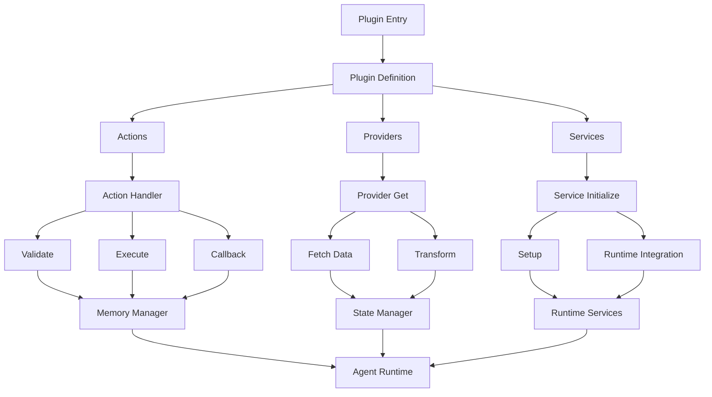

interface Plugin {
    name: string;
    description: string;
    actions?: Action[];
    providers?: Provider[];
    evaluators?: Evaluator[];
    services?: Service[];
    clients?: Client[];
}

### Key Characteristics
- **Modular**: Each plugin focuses on a specific functionality
- **Stateless**: Plugins don't maintain state between operations
- **Action-Based**: Functionality is exposed through discrete actions
- **Provider-Enabled**: Can provide data and state information
- **Service-Oriented**: May include specialized services

## Core Components

### 1. Actions

Actions are the primary way plugins expose functionality:

```typescript
interface Action {
    name: string;           // Unique action identifier
    description: string;    // What the action does
    similes: string[];     // Alternative names/commands
    examples: ActionExample[][];  // Usage examples
    validate: (runtime: IAgentRuntime) => Promise<boolean>;  // Validation logic
    handler: (runtime, message, state, options, callback) => Promise<void>;  // Main logic
}
```

### 2. Providers

Providers supply data or state information:

```typescript
interface Provider {
    get: (runtime: IAgentRuntime, message: Memory) => Promise<any>;
}
```

### 3. Services

Services handle specialized functionality:

```typescript
abstract class Service {
    static serviceType(): ServiceType;
    abstract initialize(runtime: IAgentRuntime): Promise<void>;
}
```

## Implementation Guide

### 1. Project Structure

```
plugin-[name]/
├── package.json
├── tsconfig.json
├── src/
│   ├── index.ts          # Main entry point
│   ├── plugin.ts         # Plugin definition
│   ├── types.ts          # Type definitions
│   ├── actions/          # Action implementations
│   │   ├── index.ts
│   │   └── [action].ts
│   ├── providers/        # Data providers
│   │   ├── index.ts
│   │   └── [provider].ts
│   └── services/         # Specialized services
│       ├── index.ts
│       └── [service].ts
└── tests/
    ├── actions.test.ts
    └── providers.test.ts
```

### 2. Basic Plugin Implementation

```typescript
// src/plugin.ts
import { Plugin, Action, Provider } from '@ai16z/eliza';
import { myAction } from './actions';
import { myProvider } from './providers';

export const myPlugin: Plugin = {
    name: "myPlugin",
    description: "Description of what my plugin does",
    actions: [myAction],
    providers: [myProvider]
};
```

### 3. Implementing Actions

```typescript
// src/actions/myAction.ts
export const myAction: Action = {
    name: "MY_ACTION",
    description: "Performs a specific task",
    similes: ["DO_TASK", "EXECUTE_TASK"],
    validate: async (runtime) => {
        return !!runtime.getSetting("REQUIRED_API_KEY");
    },
    handler: async (runtime, message, state, options, callback) => {
        try {
            // Action implementation
            const result = await performTask();
            callback({ text: "Task completed", ...result }, []);
        } catch (error) {
            callback({ text: "Task failed: " + error.message }, []);
        }
    },
    examples: [
        [
            {
                user: "user1",
                content: {
                    text: "Example command",
                    action: "MY_ACTION"
                }
            }
        ]
    ]
};
```

### 4. Implementing Providers

```typescript
// src/providers/myProvider.ts
export const myProvider: Provider = {
    get: async (runtime, message) => {
        // Fetch and return data
        return {
            data: await fetchData(),
            timestamp: Date.now()
        };
    }
};
```

## Testing and Validation

### 1. Unit Tests

```typescript
// tests/actions.test.ts
describe('MyAction', () => {
    it('should validate with correct API key', async () => {
        const mockRuntime = {
            getSetting: () => "valid-key"
        };
        expect(await myAction.validate(mockRuntime)).toBe(true);
    });

    it('should handle action successfully', async () => {
        const result = await myAction.handler(
            mockRuntime,
            mockMessage,
            mockState,
            {},
            mockCallback
        );
        expect(mockCallback).toHaveBeenCalledWith(
            expect.objectContaining({ text: expect.any(String) }),
            []
        );
    });
});
```

### 2. Integration Tests

```typescript
// tests/integration.test.ts
describe('Plugin Integration', () => {
    it('should work end-to-end', async () => {
        const runtime = await createTestRuntime();
        const plugin = myPlugin;

        await runtime.registerPlugin(plugin);
        const result = await runtime.executeAction("MY_ACTION", {});
        expect(result).toBeDefined();
    });
});
```

## Best Practices

1. **Error Handling**
   - Implement comprehensive error handling
   - Use descriptive error messages
   - Log errors appropriately
   - Provide helpful feedback to users

2. **Configuration Management**
   - Use environment variables for sensitive data
   - Implement proper validation
   - Document all required configuration

3. **Type Safety**
   - Use TypeScript for type safety
   - Define clear interfaces
   - Validate input/output data

4. **Documentation**
   - Document all actions and providers
   - Provide usage examples
   - Include API documentation
   - Maintain changelog

5. **Testing**
   - Write comprehensive unit tests
   - Implement integration tests
   - Test error scenarios
   - Mock external dependencies

## Example Implementations

### 1. Basic API Plugin

```typescript
// Example of a simple API-based plugin
export const apiPlugin: Plugin = {
    name: "apiPlugin",
    description: "Interacts with an external API",
    actions: [
        {
            name: "FETCH_DATA",
            description: "Fetches data from API",
            validate: async (runtime) => {
                return !!runtime.getSetting("API_KEY");
            },
            handler: async (runtime, message, state, options, callback) => {
                const client = new APIClient(runtime.getSetting("API_KEY"));
                const data = await client.fetch();
                callback({ text: "Data fetched", data }, []);
            },
            similes: ["GET_DATA", "RETRIEVE_DATA"],
            examples: [[{ user: "user1", content: { text: "fetch data" } }]]
        }
    ]
};
```

### 2. Data Provider Plugin

```typescript
// Example of a data provider plugin
export const dataPlugin: Plugin = {
    name: "dataPlugin",
    description: "Provides access to data sources",
    providers: [
        {
            get: async (runtime, message) => {
                const data = await fetchDataFromSource();
                return {
                    timestamp: Date.now(),
                    data
                };
            }
        }
    ]
};
```

## Data Flow Map



### Data Flow Description

1. **Plugin Entry**
   - Plugin is loaded and registered with the Eliza framework
   - Configuration and dependencies are initialized

2. **Core Components Flow**
   - **Actions**: Handle user commands and interactions
   - **Providers**: Supply data and state information
   - **Services**: Manage specialized functionality

3. **Action Flow**
   - Validation of prerequisites and permissions
   - Execution of business logic
   - Callback with results or errors

4. **Provider Flow**
   - Data retrieval from external sources
   - State management and caching
   - Data transformation and formatting

5. **Service Flow**
   - Initialization and setup
   - Integration with runtime services
   - Resource management

## Testing Framework

### 1. Test Directory Structure

```
plugin-[name]/
└── tests/
    ├── __mocks__/           # Mock implementations
    │   ├── api.ts
    │   └── services.ts
    ├── __fixtures__/        # Test data
    │   ├── requests.json
    │   └── responses.json
    ├── unit/
    │   ├── actions.test.ts
    │   └── providers.test.ts
    ├── integration/
    │   └── plugin.test.ts
    └── e2e/
        └── flows.test.ts
```

### 2. Test Types and Examples

#### Unit Tests

```typescript
// tests/unit/actions.test.ts
import { myAction } from '../src/actions';

describe('MyAction', () => {
    const mockRuntime = {
        getSetting: jest.fn(),
        messageManager: {
            createMemory: jest.fn()
        }
    };

    beforeEach(() => {
        jest.clearAllMocks();
    });

    test('validates with correct settings', async () => {
        mockRuntime.getSetting.mockReturnValue('valid-key');
        const result = await myAction.validate(mockRuntime);
        expect(result).toBe(true);
    });

    test('handles missing settings', async () => {
        mockRuntime.getSetting.mockReturnValue(null);
        const result = await myAction.validate(mockRuntime);
        expect(result).toBe(false);
    });

    test('processes action successfully', async () => {
        const callback = jest.fn();
        await myAction.handler(
            mockRuntime,
            { content: { text: 'test' } },
            {},
            {},
            callback
        );
        expect(callback).toHaveBeenCalledWith(
            expect.objectContaining({ text: expect.any(String) }),
            []
        );
    });
});
```

#### Integration Tests

```typescript
// tests/integration/plugin.test.ts
import { myPlugin } from '../src/plugin';
import { createTestRuntime } from '@ai16z/eliza-test';

describe('Plugin Integration', () => {
    let runtime;

    beforeAll(async () => {
        runtime = await createTestRuntime({
            settings: {
                API_KEY: 'test-key'
            }
        });
        await runtime.registerPlugin(myPlugin);
    });

    test('plugin registers successfully', () => {
        expect(runtime.actions).toContainEqual(
            expect.objectContaining({ name: 'MY_ACTION' })
        );
    });

    test('action executes end-to-end', async () => {
        const result = await runtime.executeAction('MY_ACTION', {
            text: 'test command'
        });
        expect(result).toBeDefined();
        expect(result.success).toBe(true);
    });
});
```

#### E2E Tests

```typescript
// tests/e2e/flows.test.ts
describe('Plugin E2E Flows', () => {
    test('complete user interaction flow', async () => {
        const runtime = await createTestRuntime();
        await runtime.registerPlugin(myPlugin);

        // Setup
        await runtime.initialize();

        // Execute flow
        const result1 = await runtime.executeAction('ACTION_1');
        expect(result1.success).toBe(true);

        const result2 = await runtime.executeAction('ACTION_2', {
            data: result1.data
        });
        expect(result2.success).toBe(true);

        // Verify state
        const finalState = await runtime.getState();
        expect(finalState).toMatchSnapshot();
    });
});
```

### 3. Test Utilities

```typescript
// tests/__utils__/testHelpers.ts
export function createMockMemory(content: any) {
    return {
        id: 'test-id',
        content,
        createdAt: Date.now(),
        roomId: 'test-room',
        userId: 'test-user',
        agentId: 'test-agent'
    };
}

export function createMockRuntime(settings = {}) {
    return {
        getSetting: (key: string) => settings[key],
        messageManager: {
            createMemory: jest.fn(),
            getMemories: jest.fn()
        },
        registerAction: jest.fn(),
        registerProvider: jest.fn()
    };
}
```

## Claude Prompting Guide

### 1. Initial Setup Prompt

```
I need help creating an Eliza plugin for [SERVICE_NAME]. Here's the relevant information:

1. Plugin Location: /packages/plugin-[name]
2. Service Documentation: [LINK_TO_DOCS]
3. Key Features Needed:
   - [FEATURE_1]
   - [FEATURE_2]
   - [FEATURE_3]

Please help me:
1. Set up the initial plugin structure
2. Implement core actions and providers
3. Add proper error handling and testing
```

### 2. Action Implementation Prompt

```
Help me implement an action for [ACTION_NAME] in my Eliza plugin.

Requirements:
1. Purpose: [DESCRIBE_PURPOSE]
2. Input Parameters:
   - [PARAM_1]: [TYPE] - [DESCRIPTION]
   - [PARAM_2]: [TYPE] - [DESCRIPTION]
3. Expected Output: [DESCRIBE_OUTPUT]
4. Error Handling: [SPECIFIC_REQUIREMENTS]

API Documentation: [LINK_OR_DETAILS]
```

### 3. Provider Implementation Prompt

```
I need to create a provider for [PROVIDER_NAME] in my Eliza plugin.

Details:
1. Data Source: [DESCRIBE_SOURCE]
2. Update Frequency: [SPECIFY_FREQUENCY]
3. Required Authentication: [AUTH_DETAILS]
4. Data Format: [DESCRIBE_FORMAT]

Please help implement this provider with proper error handling and caching.
```

### 4. Testing Prompt

```
Help me create tests for my Eliza plugin [PLUGIN_NAME].

Components to Test:
1. Actions:
   - [ACTION_1]
   - [ACTION_2]
2. Providers:
   - [PROVIDER_1]
   - [PROVIDER_2]
3. Integration Scenarios:
   - [SCENARIO_1]
   - [SCENARIO_2]

Please include mocks and fixtures as needed.
```

### Example Claude Conversation

```
Human: I need to create an Eliza plugin for the OpenWeather API. The plugin should support current weather and forecasts.
```

## Debugging and Troubleshooting

### 1. Common Issues

#### Missing Environment Variables
```typescript
// Example of environment variable check
function validateEnvironment() {
    const requiredVars = ['API_KEY', 'API_URL', 'DEBUG_MODE'];
    const missing = requiredVars.filter(v => !process.env[v]);

    if (missing.length > 0) {
        throw new Error(`Missing required environment variables: ${missing.join(', ')}`);
    }
}
```

#### Invalid API Responses
```typescript
// Example of API response validation
async function validateApiResponse(response: any) {
    if (!response || !response.data) {
        throw new Error('Invalid API response structure');
    }

    if (response.status >= 400) {
        throw new Error(`API error: ${response.statusText}`);
    }

    return response.data;
}
```

#### Type Mismatches
```typescript
// Example of type validation
interface ApiResponse {
    data: {
        id: string;
        value: number;
    };
}

function validateTypes(response: unknown): ApiResponse {
    if (typeof response !== 'object' || !response) {
        throw new TypeError('Response must be an object');
    }

    const { data } = response as any;
    if (!data?.id || typeof data.id !== 'string') {
        throw new TypeError('Invalid id type');
    }
    if (typeof data.value !== 'number') {
        throw new TypeError('Invalid value type');
    }

    return response as ApiResponse;
}
```

#### Runtime Errors
```typescript
// Example of runtime error handling
async function safeExecute<T>(operation: () => Promise<T>): Promise<T> {
    try {
        return await operation();
    } catch (error) {
        elizaLogger.error('Runtime error:', {
            operation: operation.name,
            error: error.message,
            stack: error.stack
        });
        throw new Error(`Operation failed: ${error.message}`);
    }
}
```

### 2. Debugging Tools

#### ElizaLogger Implementation
```typescript
// Example of elizaLogger usage
const elizaLogger = {
    debug: (message: string, context?: object) => {
        if (process.env.DEBUG_MODE === 'true') {
            console.log(`[DEBUG] ${message}`, context);
        }
    },
    error: (message: string, error?: Error) => {
        console.error(`[ERROR] ${message}`, {
            error: error?.message,
            stack: error?.stack
        });
    },
    trace: (message: string, data?: any) => {
        console.trace(`[TRACE] ${message}`, data);
    }
};
```

#### Debug Mode Implementation
```typescript
// Example of debug mode toggle
const DEBUG_MODES = {
    NONE: 0,
    BASIC: 1,
    VERBOSE: 2
} as const;

function enableDebugMode(level: keyof typeof DEBUG_MODES) {
    return {
        log: (message: string) => {
            if (DEBUG_MODES[level] >= DEBUG_MODES.BASIC) {
                elizaLogger.debug(message);
            }
        },
        trace: (message: string, data?: any) => {
            if (DEBUG_MODES[level] >= DEBUG_MODES.VERBOSE) {
                elizaLogger.trace(message, data);
            }
        }
    };
}
```

#### Performance Monitoring
```typescript
// Example of performance monitoring
class PerformanceMonitor {
    private metrics: Map<string, number[]> = new Map();

    start(operationName: string): number {
        return performance.now();
    }

    end(operationName: string, startTime: number) {
        const duration = performance.now() - startTime;
        if (!this.metrics.has(operationName)) {
            this.metrics.set(operationName, []);
        }
        this.metrics.get(operationName)!.push(duration);

        if (duration > 1000) { // 1 second threshold
            elizaLogger.debug(`Slow operation detected: ${operationName}`, {
                duration,
                timestamp: new Date().toISOString()
            });
        }
    }

    getMetrics() {
        const result: Record<string, { avg: number; count: number }> = {};
        this.metrics.forEach((durations, operation) => {
            const avg = durations.reduce((a, b) => a + b, 0) / durations.length;
            result[operation] = {
                avg,
                count: durations.length
            };
        });
        return result;
    }
}
```

## Configuration Management

### 1. Plugin Configuration

```typescript
interface PluginConfig {
    name: string;
    version: string;
    settings: {
        required: string[];
        optional: string[];
        defaults: Record<string, any>;
    };
}

class ConfigManager {
    private config: PluginConfig;
    private runtime: Runtime;

    constructor(config: PluginConfig, runtime: Runtime) {
        this.config = config;
        this.runtime = runtime;
    }

    validateConfig(): boolean {
        const missing = this.config.settings.required.filter(
            key => !this.runtime.getSetting(key)
        );

        if (missing.length > 0) {
            throw new Error(`Missing required settings: ${missing.join(', ')}`);
        }

        return true;
    }

    getSetting<T>(key: string): T {
        return this.runtime.getSetting(key) ?? this.config.settings.defaults[key];
    }
}
```

### 2. Environment-Specific Configuration

```typescript
type Environment = 'development' | 'staging' | 'production';

class EnvironmentConfig {
    private env: Environment;
    private configs: Record<Environment, Record<string, any>>;

    constructor(env: Environment) {
        this.env = env;
        this.configs = {
            development: {
                logLevel: 'debug',
                cacheTimeout: 60,
                retryAttempts: 3
            },
            staging: {
                logLevel: 'info',
                cacheTimeout: 300,
                retryAttempts: 2
            },
            production: {
                logLevel: 'warn',
                cacheTimeout: 600,
                retryAttempts: 1
            }
        };
    }

    get<T>(key: string): T {
        return this.configs[this.env][key];
    }
}
```

## Plugin Lifecycle Hooks

### 1. Initialization and Cleanup

```typescript
interface PluginLifecycle {
    onLoad?: () => Promise<void>;
    onUnload?: () => Promise<void>;
    onConfigChange?: (newConfig: any) => Promise<void>;
    onError?: (error: Error) => Promise<void>;
}

class PluginLifecycleManager {
    private hooks: PluginLifecycle;
    private isLoaded: boolean = false;

    constructor(hooks: PluginLifecycle) {
        this.hooks = hooks;
    }

    async initialize(): Promise<void> {
        try {
            if (this.hooks.onLoad) {
                await this.hooks.onLoad();
            }
            this.isLoaded = true;
        } catch (error) {
            if (this.hooks.onError) {
                await this.hooks.onError(error);
            }
            throw error;
        }
    }

    async cleanup(): Promise<void> {
        if (this.isLoaded && this.hooks.onUnload) {
            await this.hooks.onUnload();
            this.isLoaded = false;
        }
    }
}
```

### 2. State Management

```typescript
class PluginStateManager {
    private state: Map<string, any> = new Map();
    private listeners: Set<(key: string, value: any) => void> = new Set();

    setState(key: string, value: any): void {
        this.state.set(key, value);
        this.notifyListeners(key, value);
    }

    getState<T>(key: string): T | undefined {
        return this.state.get(key);
    }

    subscribe(listener: (key: string, value: any) => void): () => void {
        this.listeners.add(listener);
        return () => this.listeners.delete(listener);
    }

    private notifyListeners(key: string, value: any): void {
        this.listeners.forEach(listener => listener(key, value));
    }
}
```

## Error Handling Patterns

### 1. Custom Error Types

```typescript
class PluginError extends Error {
    constructor(
        message: string,
        public code: string,
        public details?: any
    ) {
        super(message);
        this.name = 'PluginError';
    }
}

class ValidationError extends PluginError {
    constructor(message: string, details?: any) {
        super(message, 'VALIDATION_ERROR', details);
        this.name = 'ValidationError';
    }
}

class ApiError extends PluginError {
    constructor(message: string, details?: any) {
        super(message, 'API_ERROR', details);
        this.name = 'ApiError';
    }
}
```

### 2. Error Recovery Strategies

```typescript
class ErrorRecoveryManager {
    private maxRetries: number;
    private backoffMs: number;

    constructor(maxRetries: number = 3, backoffMs: number = 1000) {
        this.maxRetries = maxRetries;
        this.backoffMs = backoffMs;
    }

    async withRetry<T>(
        operation: () => Promise<T>,
        shouldRetry: (error: Error) => boolean
    ): Promise<T> {
        let lastError: Error;
        
        for (let attempt = 1; attempt <= this.maxRetries; attempt++) {
            try {
                return await operation();
            } catch (error) {
                lastError = error;
                
                if (!shouldRetry(error) || attempt === this.maxRetries) {
                    throw error;
                }
                
                await this.delay(attempt);
            }
        }
        
        throw lastError!;
    }

    private delay(attempt: number): Promise<void> {
        const ms = this.backoffMs * Math.pow(2, attempt - 1);
        return new Promise(resolve => setTimeout(resolve, ms));
    }
}
```

## Documentation Standards

### 1. Code Documentation

```typescript
/**
 * Represents a plugin action that can be executed by the runtime.
 * 
 * @template TInput - The type of input data expected by the action
 * @template TOutput - The type of output data produced by the action
 * 
 * @example
 * ```typescript
 * const myAction = new PluginAction<string, number>({
 *     name: 'convertToNumber',
 *     execute: async (input) => parseInt(input, 10)
 * });
 * ```
 */
interface PluginAction<TInput, TOutput> {
    /** Unique identifier for the action */
    name: string;
    
    /** 
     * Executes the action with the given input
     * @param input - The input data for the action
     * @returns A promise that resolves with the action result
     * @throws {ValidationError} If the input is invalid
     * @throws {ApiError} If an API call fails
     */
    execute(input: TInput): Promise<TOutput>;
    
    /** 
     * Validates the action input
     * @param input - The input to validate
     * @returns True if the input is valid
     */
    validate?(input: TInput): Promise<boolean>;
}
```

### 2. README Template

```markdown
# Plugin Name

## Overview
Brief description of what the plugin does and its main features.

## Installation
```bash
npm install @eliza/plugin-name
```

## Configuration
| Setting | Type | Required | Default | Description |
|---------|------|----------|---------|-------------|
| API_KEY | string | Yes | - | API key for authentication |
| TIMEOUT | number | No | 5000 | Request timeout in ms |

## Usage
```typescript
import { MyPlugin } from '@eliza/plugin-name';

const plugin = new MyPlugin();
await runtime.registerPlugin(plugin);
```

## Actions
- `actionName`: Description of what the action does
  - Input: `{ field: type }`
  - Output: `{ field: type }`
  - Example: Code example

## Providers
- `providerName`: Description of what the provider supplies
  - Data Format: `{ field: type }`
  - Update Frequency: How often the data updates
  - Example: Code example

## Error Handling
Common errors and how to handle them:
- `VALIDATION_ERROR`: Invalid input provided
- `API_ERROR`: External API request failed

## Development
Instructions for local development and testing.

## Contributing
Guidelines for contributing to the plugin.

## License
License information.
```

## Deployment and Distribution

### 1. Package Publishing

#### Version Management
```typescript
// Example of version management
interface VersionInfo {
    major: number;
    minor: number;
    patch: number;
}

function updateVersion(current: string, type: 'major' | 'minor' | 'patch'): string {
    const [major, minor, patch] = current.split('.').map(Number);
    const version: VersionInfo = { major, minor, patch };

    switch (type) {
        case 'major':
            version.major++;
            version.minor = 0;
            version.patch = 0;
            break;
        case 'minor':
            version.minor++;
            version.patch = 0;
            break;
        case 'patch':
            version.patch++;
            break;
    }

    return `${version.major}.${version.minor}.${version.patch}`;
}
```

#### Changelog Generation
```typescript
// Example of changelog generation
interface ChangelogEntry {
    type: 'feature' | 'fix' | 'breaking';
    description: string;
    commit: string;
}

class ChangelogGenerator {
    private entries: ChangelogEntry[] = [];

    addEntry(entry: ChangelogEntry) {
        this.entries.push(entry);
    }

    generateMarkdown(): string {
        const grouped = this.entries.reduce((acc, entry) => {
            if (!acc[entry.type]) {
                acc[entry.type] = [];
            }
            acc[entry.type].push(entry);
            return acc;
        }, {} as Record<string, ChangelogEntry[]>);

        return Object.entries(grouped)
            .map(([type, entries]) => {
                return `## ${type.toUpperCase()}\n\n${
                    entries
                        .map(e => `- ${e.description} (${e.commit})`)
                        .join('\n')
                }\n`;
            })
            .join('\n');
    }
}
```

### 2. Integration Steps

#### Plugin Registration
```typescript
// Example of plugin registration
interface PluginMetadata {
    name: string;
    version: string;
    actions: string[];
    providers: string[];
}

async function registerPlugin(runtime: Runtime, metadata: PluginMetadata) {
    try {
        // Validate plugin metadata
        if (!metadata.name || !metadata.version) {
            throw new Error('Invalid plugin metadata');
        }

        // Register actions
        for (const action of metadata.actions) {
            await runtime.registerAction(action);
        }

        // Register providers
        for (const provider of metadata.providers) {
            await runtime.registerProvider(provider);
        }

        elizaLogger.debug(`Plugin ${metadata.name} registered successfully`);
    } catch (error) {
        elizaLogger.error(`Failed to register plugin: ${error.message}`);
        throw error;
    }
}
```

## Maintenance and Updates

### 1. Version Control

#### Semantic Versioning Implementation
```typescript
// Example of semantic versioning implementation
class SemanticVersion {
    constructor(
        public major: number,
        public minor: number,
        public patch: number
    ) {}

    toString(): string {
        return `${this.major}.${this.minor}.${this.patch}`;
    }

    static parse(version: string): SemanticVersion {
        const [major, minor, patch] = version
            .split('.')
            .map(v => parseInt(v, 10));
        return new SemanticVersion(major, minor, patch);
    }

    isCompatibleWith(other: SemanticVersion): boolean {
        return this.major === other.major;
    }
}
```

### 2. Monitoring

#### Metrics Collection
```typescript
// Example of metrics collection
class MetricsCollector {
    private metrics: Map<string, number> = new Map();

    increment(metric: string, value: number = 1) {
        const current = this.metrics.get(metric) || 0;
        this.metrics.set(metric, current + value);
    }

    record(metric: string, value: number) {
        this.metrics.set(metric, value);
    }

    getMetrics(): Record<string, number> {
        return Object.fromEntries(this.metrics);
    }

    async report() {
        try {
            // Send metrics to monitoring service
            await sendMetrics(this.getMetrics());
            this.metrics.clear();
        } catch (error) {
            elizaLogger.error('Failed to report metrics', error);
        }
    }
}
```

#### Error Tracking
```typescript
// Example of error tracking
class ErrorTracker {
    private errors: Error[] = [];

    track(error: Error) {
        this.errors.push(error);
        elizaLogger.error('Error tracked:', error);

        // Report to error tracking service
        this.report(error);
    }

    private async report(error: Error) {
        try {
            await sendErrorToService({
                message: error.message,
                stack: error.stack,
                timestamp: new Date().toISOString()
            });
        } catch (reportError) {
            elizaLogger.error('Failed to report error', reportError);
        }
    }
}
```

## Security Considerations

### 1. API Security

#### Secure API Key Storage
```typescript
// Example of secure API key handling
class SecureConfig {
    private static instance: SecureConfig;
    private secrets: Map<string, string> = new Map();

    private constructor() {
        // Load secrets from secure storage
        this.loadSecrets();
    }

    private loadSecrets() {
        // Load from environment variables or secure storage
        const apiKey = process.env.API_KEY;
        if (!apiKey) {
            throw new Error('API key not found in secure storage');
        }
        this.secrets.set('apiKey', apiKey);
    }

    static getInstance(): SecureConfig {
        if (!SecureConfig.instance) {
            SecureConfig.instance = new SecureConfig();
        }
        return SecureConfig.instance;
    }

    getSecret(key: string): string {
        const value = this.secrets.get(key);
        if (!value) {
            throw new Error(`Secret ${key} not found`);
        }
        return value;
    }
}
```

#### Input Validation
```typescript
// Example of input validation
function validateInput(input: unknown): void {
    if (typeof input !== 'object' || !input) {
        throw new Error('Invalid input: must be an object');
    }

    const { data } = input as any;
    if (!data) {
        throw new Error('Missing required field: data');
    }

    // Sanitize input
    const sanitized = sanitizeHtml(data);
    if (sanitized !== data) {
        throw new Error('Input contains potentially harmful content');
    }
}
```

### 2. Data Protection

#### Encryption Implementation
```typescript
// Example of data encryption
import { createCipheriv, createDecipheriv, randomBytes } from 'crypto';

class DataEncryption {
    private readonly algorithm = 'aes-256-gcm';
    private readonly key: Buffer;

    constructor(encryptionKey: string) {
        this.key = Buffer.from(encryptionKey, 'hex');
    }

    encrypt(data: string): { encrypted: string; iv: string } {
        const iv = randomBytes(16);
        const cipher = createCipheriv(this.algorithm, this.key, iv);

        const encrypted = Buffer.concat([
            cipher.update(data, 'utf8'),
            cipher.final()
        ]);

        return {
            encrypted: encrypted.toString('hex'),
            iv: iv.toString('hex')
        };
    }

    decrypt(encrypted: string, iv: string): string {
        const decipher = createDecipheriv(
            this.algorithm,
            this.key,
            Buffer.from(iv, 'hex')
        );

        const decrypted = Buffer.concat([
            decipher.update(Buffer.from(encrypted, 'hex')),
            decipher.final()
        ]);

        return decrypted.toString('utf8');
    }
}
```

## Performance Optimization

### 1. Caching

#### Cache Implementation
```typescript
// Example of caching implementation
class ResponseCache {
    private cache: Map<string, { data: any; timestamp: number }> = new Map();
    private readonly TTL: number = 5 * 60 * 1000; // 5 minutes

    async get(key: string, fetchFn: () => Promise<any>) {
        const cached = this.cache.get(key);
        if (cached && Date.now() - cached.timestamp < this.TTL) {
            return cached.data;
        }

        const data = await fetchFn();
        this.cache.set(key, {
            data,
            timestamp: Date.now()
        });
        return data;
    }

    clear() {
        this.cache.clear();
    }
}
```

#### Rate Limiting
```typescript
// Example of rate limiting
class RateLimiter {
    private requests: number[] = [];
    private readonly limit: number;
    private readonly window: number;

    constructor(limit: number, windowMs: number) {
        this.limit = limit;
        this.window = windowMs;
    }

    async checkLimit(): Promise<boolean> {
        const now = Date.now();
        this.requests = this.requests.filter(time => now - time < this.window);

        if (this.requests.length >= this.limit) {
            return false;
        }

        this.requests.push(now);
        return true;
    }
}